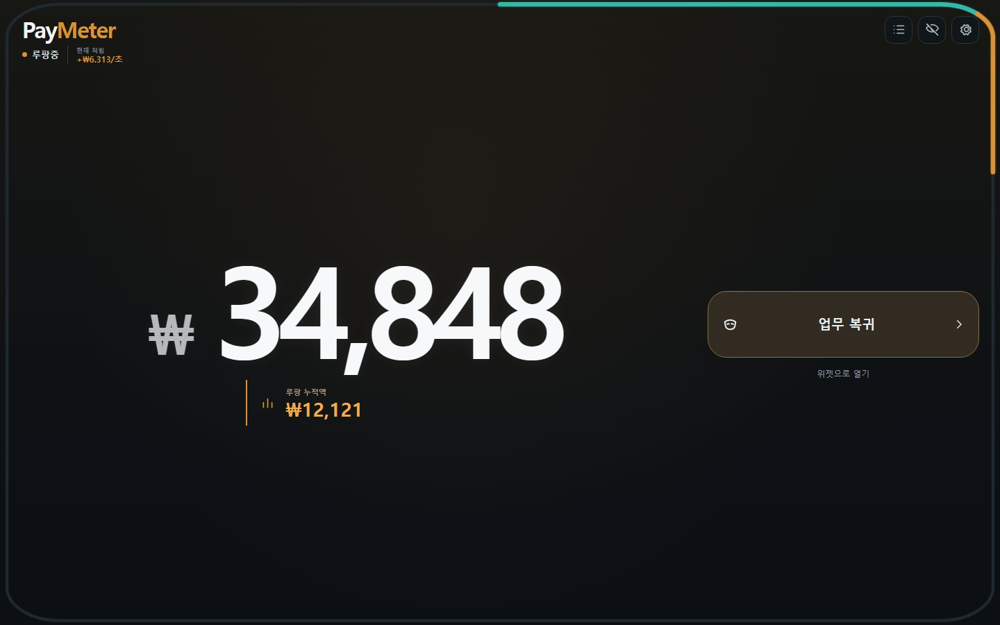
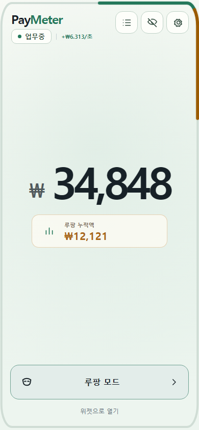
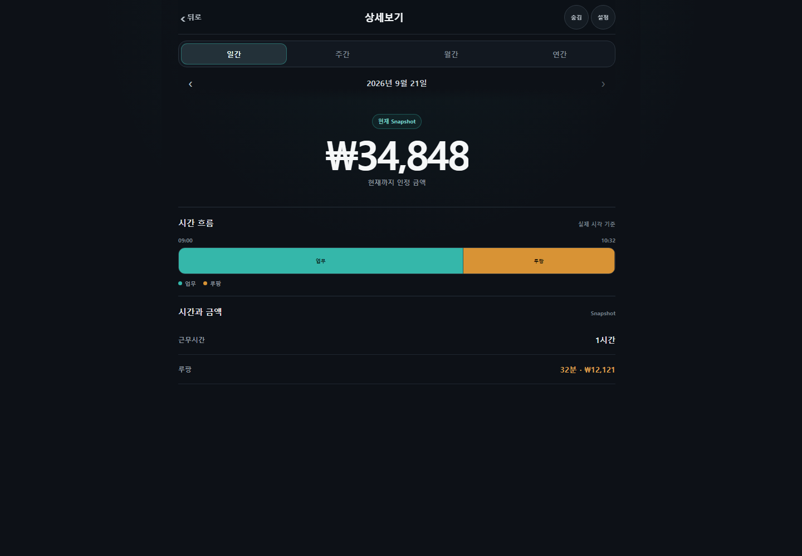

# PayMeter

**월급이 지금 이 순간 얼마씩 쌓이고 있는지 보여주는 Local First Money Timer**

월급과 근무시간을 입력하면 오늘 인정되는 금액, 초당 적립액, 루팡으로 쌓인 금액을 실시간으로 계산합니다. 별도 계정이나 서버 없이 브라우저에서 바로 사용할 수 있습니다.

> **[PayMeter 바로 실행하기](https://pay-meter-three.vercel.app)**



_월급 400만 원, 평일 09:00–18:00 근무를 가정한 데모 화면입니다._

## 어떻게 사용하나요?

1. **월급과 근무시간을 설정합니다.**
   근무 요일, 출퇴근 시간, 무급 휴게시간을 입력하면 하루 목표 금액과 초당 적립액을 계산합니다.

2. **Money Timer를 켜 둡니다.**
   화면 외곽선은 오늘의 유급 근무 진행도를 나타냅니다. 금액은 UI tick 횟수가 아니라 현재 시각과 근무 일정으로 매번 다시 계산하므로 새로고침하거나 백그라운드에 두어도 이어집니다.

3. **잠깐 딴짓할 때 `루팡 모드`를 누릅니다.**
   루팡 구간은 외곽선과 상세 시간표에 별도 색으로 기록되고, 해당 시간에 쌓인 금액도 따로 확인할 수 있습니다.

## 실제 화면

<table>
  <tr>
    <td width="34%" align="center"><strong>모바일 · Light/Pocket</strong></td>
    <td width="66%" align="center"><strong>일간 상세보기</strong></td>
  </tr>
  <tr>
    <td valign="top"></td>
    <td valign="top"></td>
  </tr>
</table>

Dark/Light 베이스에 `Meter`, `Mono`, `Pocket`, `Ledger` 테마를 조합할 수 있습니다. 데스크톱, 모바일, 작은 위젯 화면에서도 같은 계산 결과와 테마를 유지합니다.

## 주요 기능

- 오늘 인정 금액과 초당 적립액 실시간 표시
- 정상 업무와 루팡 구간을 구분하는 외곽 Progress Timeline
- 루팡 시간과 해당 금액 별도 집계
- 일간·주간·월간·연간 상세 리포트
- 근무 종료 후 무상 노동 환산액을 보여주는 무료봉사 Wallet
- 금액을 즉시 가리는 Privacy Mode
- 지원 브라우저의 Document Picture-in-Picture 위젯
- Dark/Light 베이스와 4종 테마, 자동·집중형·분할형 레이아웃
- JSON 데이터 내보내기와 PWA Offline App Shell

## 데이터는 어디에 저장되나요?

PayMeter는 **Local First**로 동작합니다.

- 급여, 근무 일정, 루팡 기록은 현재 브라우저의 `localStorage`에 저장됩니다.
- 앱에는 로그인, 광고 SDK, 분석 SDK, 별도 데이터 수집 API가 없습니다.
- 데이터가 필요할 때 사용자가 직접 JSON 파일로 내보낼 수 있습니다.
- 브라우저 데이터를 지우거나 다른 기기를 사용하면 기록은 자동으로 이동되지 않습니다.

Privacy Mode는 화면의 금액을 가리는 기능입니다. 로컬에 저장된 원본 데이터를 암호화하는 기능은 아닙니다.

## 계산 방식

PayMeter는 `setInterval` 호출 횟수를 돈으로 누적하지 않습니다. 다음 원본 데이터를 현재 시각과 다시 계산합니다.

```text
월급 + 근무 요일 + 출퇴근 시간 + 무급 휴게시간
                         ↓
               오늘의 유급시간과 목표 금액
                         ↓
           현재 시각 기준 인정 금액과 초당 적립액
                         ↓
       업무 / 루팡 / 휴게 / 무료봉사 구간으로 표시
```

따라서 브라우저 sleep, background throttling, 새로고침 이후에도 동일한 원본 데이터라면 같은 결과를 계산합니다.

## 로컬 실행

Node.js 22 이상을 권장합니다.

```bash
npm ci
npm run dev
```

production build와 전체 검증:

```bash
npm run lint
npm run format:check
npm test
npm run build
npm run e2e
```

현재 검증 기준은 Unit test 64개와 Playwright E2E 22개입니다.

## 범위와 제한

PayMeter는 근무시간의 금전적 가치를 직관적으로 보여주는 개인용 타이머입니다. 정밀 근태 시스템, 급여 명세서, 세금 계산기 또는 법정 수당 판정 도구가 아닙니다. 공휴일, 연차, 교대근무, 자정 넘김 일정과 복합 수당 정책은 자동 처리하지 않습니다.

## 문서

- [제품 요구사항](Docs/01_PRODUCT_REQUIREMENTS.md)
- [급여·시간 계산 규칙](Docs/02_PAY_TIME_ENGINE_SPEC.md)
- [데이터 저장 규칙](Docs/03_DATA_STORAGE_SPEC.md)
- [UI/UX 규칙](Docs/04_UI_UX_SPEC.md)
- [기술 구조](Docs/05_TECHNICAL_ARCHITECTURE.md)
- [테마와 레이아웃 설계](Docs/THEME_LAYOUT_CUSTOMIZATION_DESIGN.md)

## Repository

- Project: PayMeter
- Repository: [nothing2that-sys/pay-meter](https://github.com/nothing2that-sys/pay-meter)
- Live: [pay-meter-three.vercel.app](https://pay-meter-three.vercel.app)
